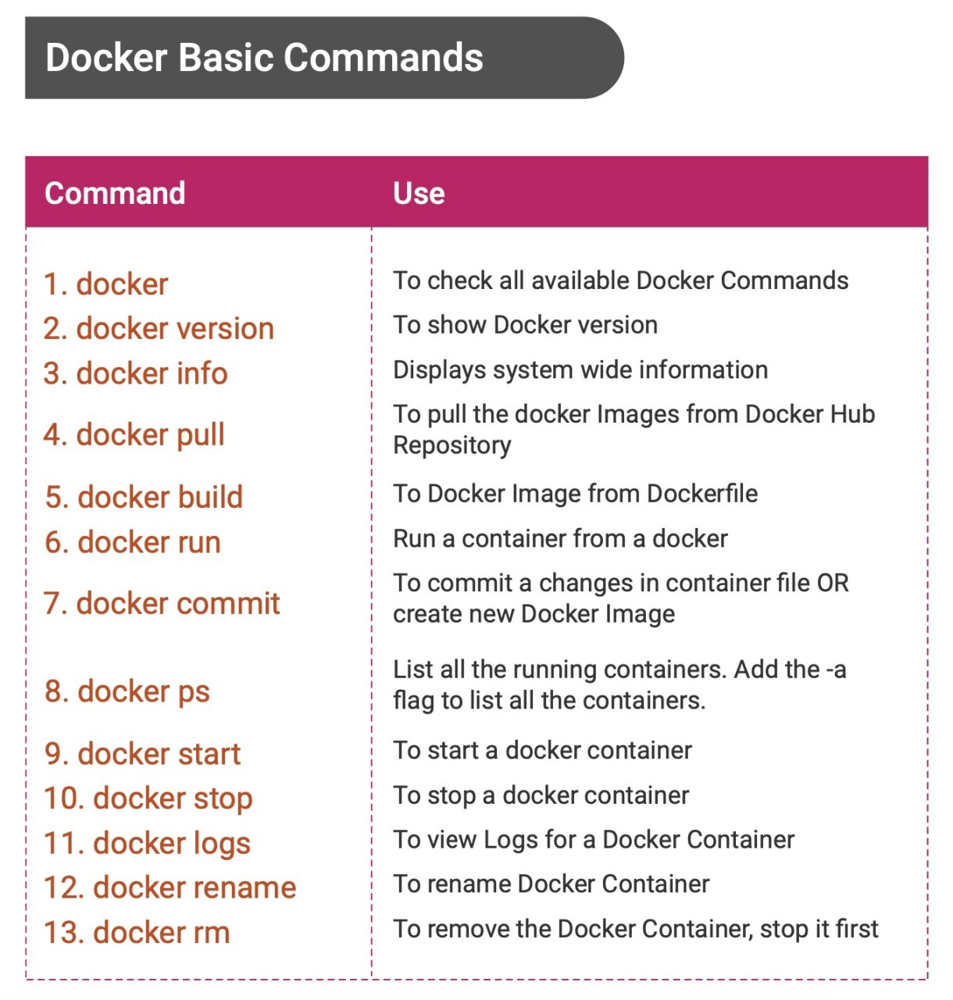
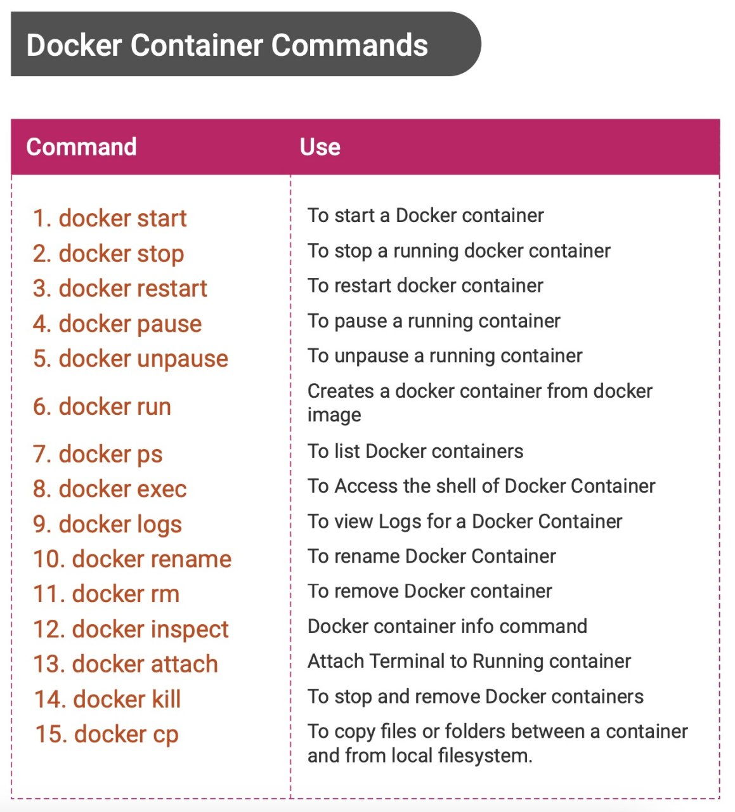
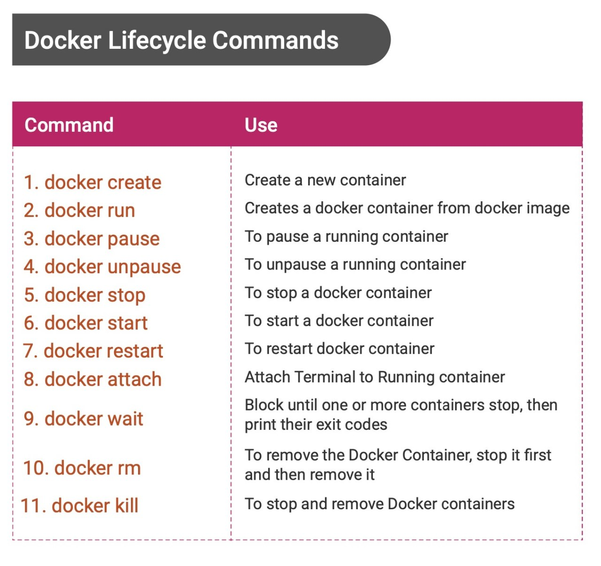
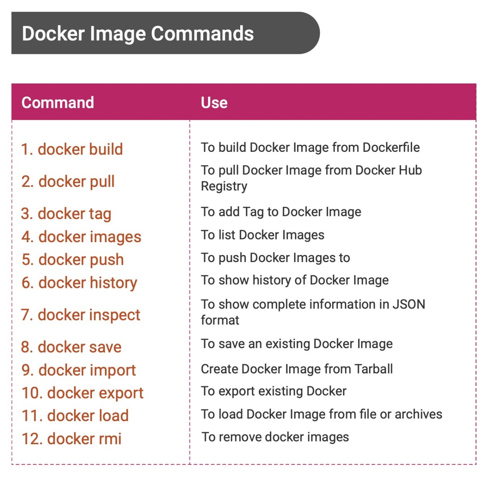
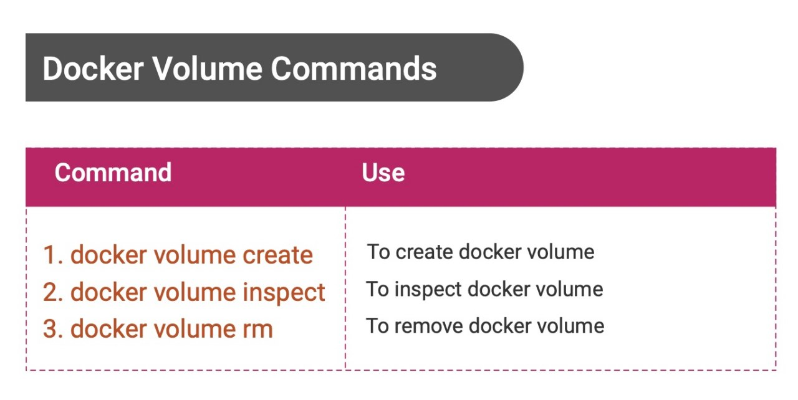
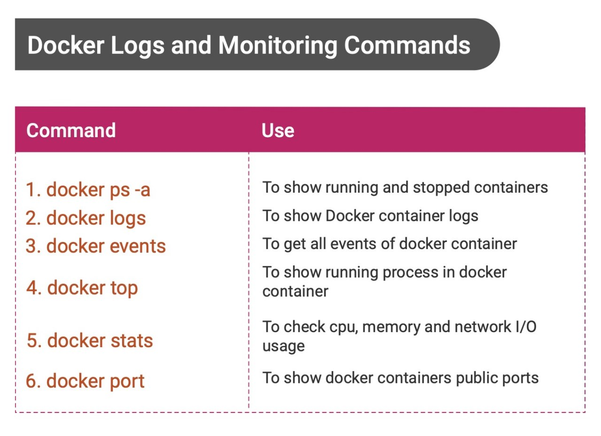
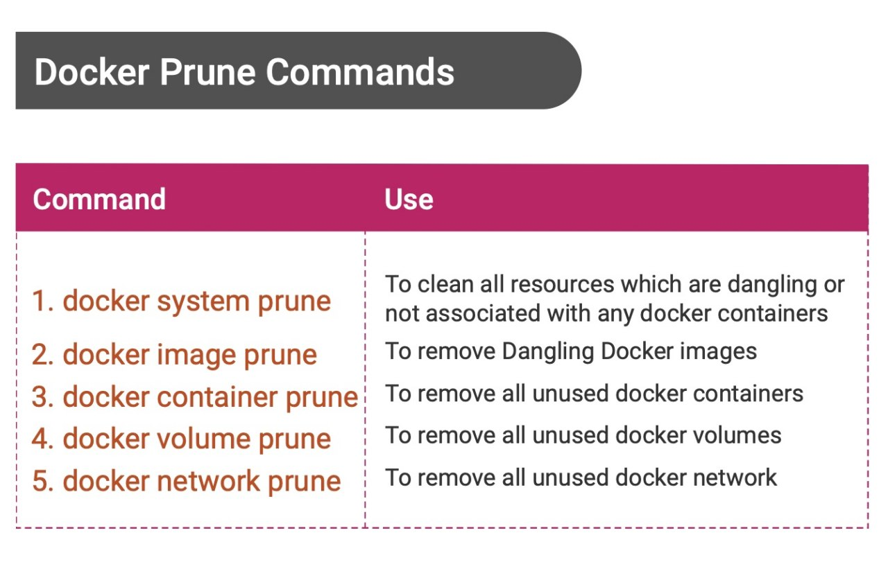
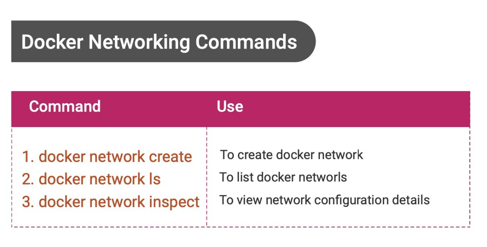
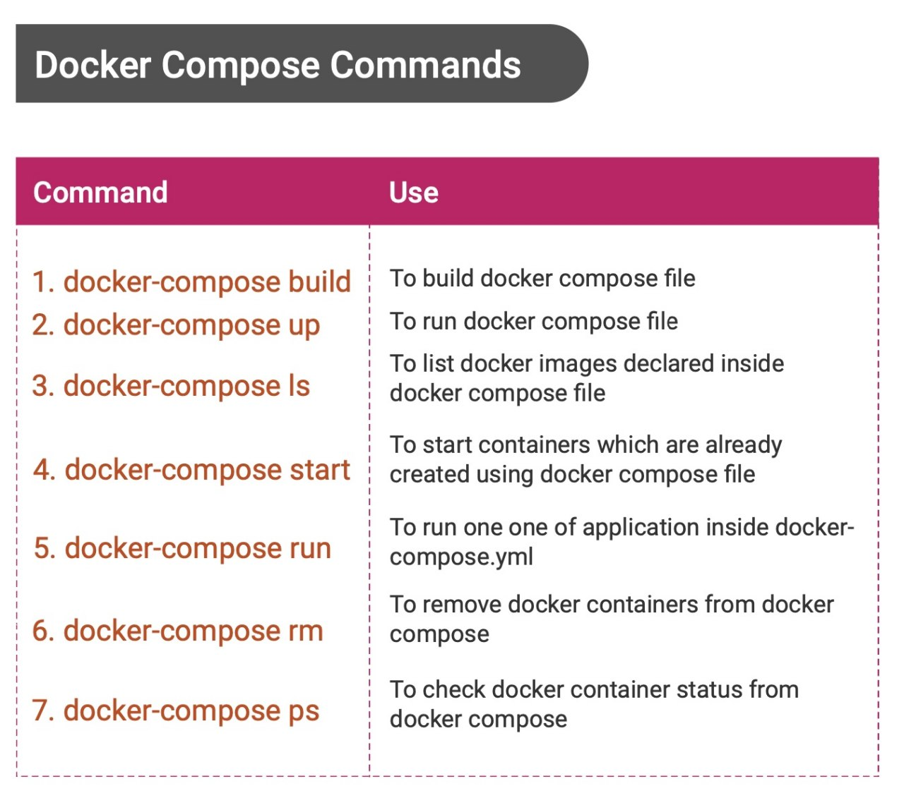

# Cheatshet for Docker

## Docker Basic Commands

## Docker Container Commands

## Docker Lifecyle Commands

## Docker Image Commands

## Docker Volume Commands

## Docker Log And Monitor

## Docker Purne Commands

## Docker Network Commands

## Docker Compose Commands

